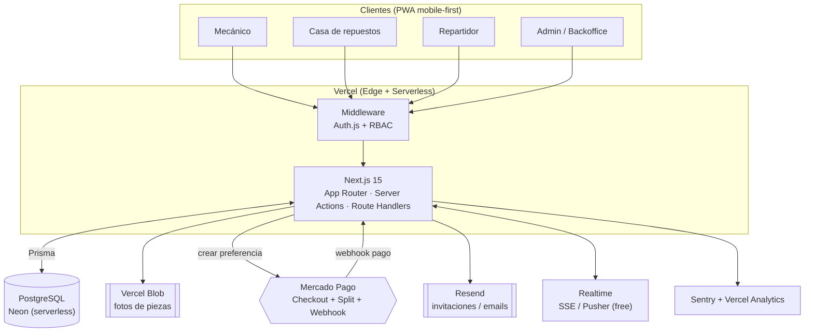
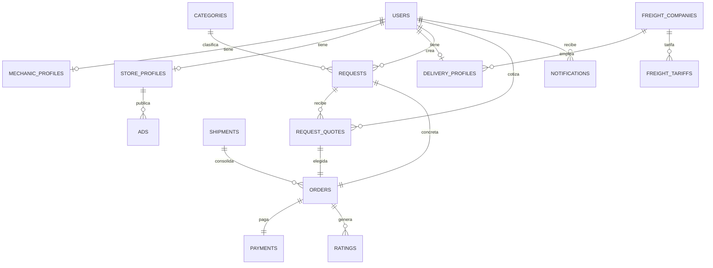
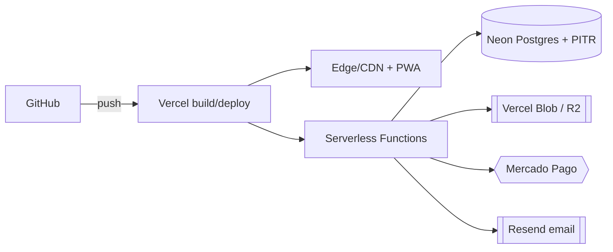
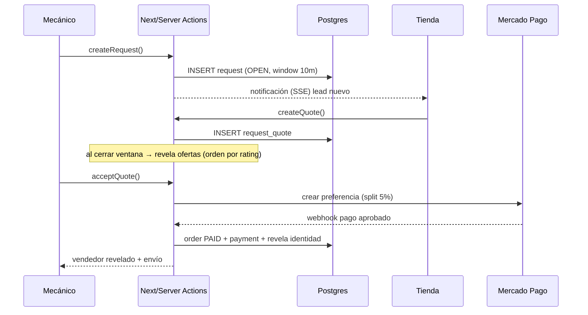

# RepuestosAlToque — Arquitectura técnica del MVP

> Diseño técnico del MVP para Bariloche que conecta **mecánicos, casas de repuestos, repartidores y administradores**.
> Basado en `README.md` y los docs de [modelo de datos](RepuestosAlToque-Modelo-de-Datos.md) y [reglas de negocio](RepuestosAlToque-Reglas-de-Negocio.md).
> *(No existe un `request-flow.md`; el flujo se tomó del README y las reglas de negocio.)*

**Stack objetivo:** Next.js 15 (App Router + Server Actions) · TypeScript · TailwindCSS · PostgreSQL · Prisma · Auth.js (NextAuth v5) · PWA.
**Principio rector:** lanzar rápido, validar mercado y soportar los primeros **miles de pedidos/mes** con el **menor costo operativo**. No sobre‑ingenierizar.

---

## 1. Arquitectura general



| Capa | Decisión | Por qué |
|------|----------|---------|
| **Frontend** | Next.js 15 App Router, **PWA** mobile-first, Tailwind | Un solo proyecto full‑stack; SSR + Server Actions evita una API separada; PWA = "instalable" en el celular del taller sin tienda de apps. |
| **Backend** | **Server Actions** + Route Handlers (en el mismo Next) | Menos piezas que un backend aparte; tipado end‑to‑end con TS/Prisma; Route Handlers solo para webhooks (Mercado Pago) y auth. |
| **Base de datos** | **PostgreSQL** gestionada (**Neon**) + **Prisma** | Modelo relacional natural (pedidos→cotizaciones→ventas); Neon escala a cero (barato), branching y PITR. Prisma da migraciones y tipos. |
| **Storage de imágenes** | **Vercel Blob** (o Cloudflare R2) | Fotos de piezas y comprobantes; URLs servidas por CDN; integración directa con Vercel. R2 si se quiere abaratar a escala. |
| **Autenticación** | **Auth.js (NextAuth v5)** con credenciales + email (magic link para invitaciones) | El alta es manual; el admin invita y el usuario fija su contraseña. Sesión por cookie httpOnly; rol guardado en el token. |
| **Hosting** | **Vercel** | Deploy desde GitHub, edge/CDN, serverless, preview por PR. Free/Pro alcanza para el MVP. |
| **Realtime** | **SSE** (o Pusher free tier) | Para que lleguen cotizaciones/notificaciones sin recargar. SSE casero alcanza al inicio; Pusher si crece. |
| **Observabilidad** | **Sentry** (errores) + **Vercel Analytics** + logs | Detectar fallas en producción desde el día 1 con costo casi nulo. |

---

## 2. Modelo de datos (PostgreSQL)

Resumen de tablas (detalle de tipos en el Prisma schema de la sección 3). Convención: `snake_case` en DB vía `@map`.

| Tabla | Rol | Campos clave | Índices | Restricciones |
|-------|-----|--------------|---------|---------------|
| **users** | cuentas + rol | id, email (uniq), password_hash, role, status, name, phone, whatsapp | `email`, `role`, `status` | email único; role enum |
| **mechanic_profiles** | perfil mecánico | user_id (uniq/FK), workshop_name, kind, barrio, lat/lng, cuit, rating_avg, points | `user_id` | 1‑1 con users |
| **store_profiles** | perfil vendedor | user_id, trade_name, legal_name, cuit (uniq), iva_condition, barrio, mp_user_id, mp_linked, cbu, rating_avg, points | `user_id`, `cuit` | CUIT único; 1‑1 |
| **delivery_profiles** | perfil repartidor | user_id, freight_company_id, vehicle_type, plate, zones | `user_id`, `freight_company_id` | 1‑1 |
| **vehicles** | catálogo marca/modelo | id, brand, model | `brand` | (brand, model) único |
| **requests** | pedido (1 producto) | id, code (uniq), mechanic_id, brand/model/year/vin, category_id, description, urgency, invoice_type (+datos), status, window_ends_at, photo_urls | `mechanic_id`, `status`, `created_at` | status enum; mechanic FK |
| **request_quotes** | cotización | id, request_id, store_id, alias, part_brand, price, warranty, photo_urls (≤3), rating_snapshot, status, option_label | `request_id`, `store_id` | price ≥ 0; fotos ≤ 3 |
| **orders** | venta concretada | id, request_id, quote_id, mechanic_id, store_id, part_amount, commission_amount, freight_amount, total, payer, status, shipment_id | `mechanic_id`, `store_id`, `shipment_id` | 1 order por quote aceptada |
| **payments** | pago MP | id, order_id, mp_payment_id, status, amount, split (jsonb), raw (jsonb) | `order_id`, `mp_payment_id` | order FK |
| **shipments** | envío (consolida) | id, mechanic_id, freight_company_id, package_size, status | `mechanic_id` | 1‑N con orders |
| **notifications** | avisos a usuarios | id, user_id, type, title, body, read_at, data (jsonb) | `user_id, read_at` | user FK |
| **audit_logs** | auditoría admin | id, actor_id, action, entity, entity_id, payload (jsonb), created_at | `actor_id`, `entity` | — |
| *(soporte)* categories, freight_companies, freight_tariffs, ratings, ads | | | | |

**ERD:**



**Anonimato en la capa de datos:** las cotizaciones se exponen al mecánico mediante una capa de lectura (Server Action / select acotado) que **omite `store_id` y datos del vendedor**; la identidad real se "desbloquea" solo cuando existe una `order` pagada de esa cotización.

---

## 3. Prisma schema

```prisma
// prisma/schema.prisma
generator client { provider = "prisma-client-js" }
datasource db { provider = "postgresql"; url = env("DATABASE_URL") }

enum Role          { ADMIN MECHANIC STORE DELIVERY }
enum UserStatus    { PENDING ACTIVE SUSPENDED }
enum IvaCondition  { RESPONSABLE_INSCRIPTO MONOTRIBUTO EXENTO CONSUMIDOR_FINAL }
enum Urgency       { AHORA HOY MANANA }
enum InvoiceType   { CONSUMIDOR_FINAL FACTURA_A }
enum RequestStatus { OPEN CLOSED QUOTED PAID SHIPPED DELIVERED CANCELLED EXPIRED }
enum QuoteStatus   { SENT SELECTED REJECTED }
enum OrderStatus   { PAID READY SHIPPED DELIVERED REFUNDED }
enum ShipmentStatus{ PENDING PICKED_UP ON_ROUTE DELIVERED }
enum PackageSize   { MOTO AUTO UTILITARIO }
enum PartCondition { NUEVO USADO REACONDICIONADO }
enum NotificationType { NEW_QUOTE QUOTE_WINDOW_CLOSED ORDER_PAID INFO_REQUEST SHIPMENT_UPDATE SYSTEM }

model User {
  id           String     @id @default(cuid())
  email        String     @unique
  passwordHash String?    @map("password_hash")
  role         Role
  status       UserStatus @default(ACTIVE)
  name         String?
  phone        String?
  whatsapp     String?
  createdAt    DateTime   @default(now()) @map("created_at")
  createdById  String?    @map("created_by_id")
  termsAcceptedAt DateTime? @map("terms_accepted_at")

  mechanic   MechanicProfile?
  store      StoreProfile?
  delivery   DeliveryProfile?
  requests   Request[]        @relation("mechanicRequests")
  quotes     RequestQuote[]   @relation("storeQuotes")
  notifications Notification[]
  @@index([role]); @@index([status]); @@map("users")
}

model MechanicProfile {
  userId       String  @id @map("user_id")
  user         User    @relation(fields: [userId], references: [id], onDelete: Cascade)
  workshopName String? @map("workshop_name")
  kind         String  @default("taller")   // taller | particular
  barrio       String?
  address      String?
  lat          Float?
  lng          Float?
  cuit         String?
  ratingAvg    Decimal @default(0) @map("rating_avg") @db.Decimal(2,1)
  ratingsCount Int     @default(0) @map("ratings_count")
  points       Int     @default(0)
  completedOps Int     @default(0) @map("completed_ops")
  @@map("mechanic_profiles")
}

model StoreProfile {
  userId        String        @id @map("user_id")
  user          User          @relation(fields: [userId], references: [id], onDelete: Cascade)
  tradeName     String        @map("trade_name")
  legalName     String?       @map("legal_name")
  cuit          String?       @unique
  ivaCondition  IvaCondition? @map("iva_condition")
  ownerName     String?       @map("owner_name")
  address       String?
  barrio        String?
  lat           Float?
  lng           Float?
  hours         Json?
  contactPerson String?       @map("contact_person")
  partCondition PartCondition @default(NUEVO) @map("part_condition")
  mpUserId      String?       @map("mp_user_id")   // cuenta MP vinculada (split)
  mpLinked      Boolean       @default(false) @map("mp_linked")
  cbu           String?
  mpAlias       String?       @map("mp_alias")
  invoiceType   String?       @map("invoice_type") // A/B/C que emite
  afipPos       String?       @map("afip_pos")
  logoUrl       String?       @map("logo_url")
  ratingAvg     Decimal       @default(0) @map("rating_avg") @db.Decimal(2,1)
  ratingsCount  Int           @default(0) @map("ratings_count")
  points        Int           @default(0)
  categories    StoreCategory[]
  ads           Ad[]
  @@map("store_profiles")
}

model DeliveryProfile {
  userId          String  @id @map("user_id")
  user            User    @relation(fields: [userId], references: [id], onDelete: Cascade)
  freightCompanyId String? @map("freight_company_id")
  freightCompany  FreightCompany? @relation(fields: [freightCompanyId], references: [id])
  vehicleType     PackageSize? @map("vehicle_type")
  plate           String?
  zones           Json?
  @@map("delivery_profiles")
}

model Category {
  id       Int     @id @default(autoincrement())
  slug     String  @unique
  name     String
  icon     String?
  requests Request[]
  stores   StoreCategory[]
  @@map("categories")
}
model StoreCategory {
  storeId    String @map("store_id")
  categoryId Int    @map("category_id")
  store      StoreProfile @relation(fields: [storeId], references: [userId], onDelete: Cascade)
  category   Category     @relation(fields: [categoryId], references: [id])
  @@id([storeId, categoryId]); @@map("store_categories")
}

model Vehicle {  // catálogo
  id    Int    @id @default(autoincrement())
  brand String
  model String
  @@unique([brand, model]); @@index([brand]); @@map("vehicles")
}

model Request {
  id           String        @id @default(cuid())
  code         String        @unique               // #1042 legible (secuencia)
  mechanicId   String        @map("mechanic_id")
  mechanic     User          @relation("mechanicRequests", fields: [mechanicId], references: [id])
  brand        String?
  model        String?
  year         Int?
  vin          String?
  categoryId   Int?          @map("category_id")
  category     Category?     @relation(fields: [categoryId], references: [id])
  description  String?
  urgency      Urgency       @default(AHORA)
  photoUrls    String[]      @map("photo_urls")
  invoiceType  InvoiceType   @default(CONSUMIDOR_FINAL) @map("invoice_type")
  invEmisorName String?      @map("inv_emisor_name")
  invEmisorCuit String?      @map("inv_emisor_cuit")
  invBuyerName  String?      @map("inv_buyer_name")
  invBuyerCuit  String?      @map("inv_buyer_cuit")
  status       RequestStatus @default(OPEN)
  windowEndsAt DateTime?     @map("window_ends_at")
  extraInfo    String?       @map("extra_info")
  createdAt    DateTime      @default(now()) @map("created_at")
  quotes       RequestQuote[]
  order        Order?
  @@index([mechanicId]); @@index([status]); @@index([createdAt]); @@map("requests")
}

model RequestQuote {
  id             String      @id @default(cuid())
  requestId      String      @map("request_id")
  request        Request     @relation(fields: [requestId], references: [id], onDelete: Cascade)
  storeId        String      @map("store_id")
  store          User        @relation("storeQuotes", fields: [storeId], references: [id])
  alias          String                                   // visible al mecánico (anónimo)
  optionLabel    String?     @map("option_label")
  partBrand      String?     @map("part_brand")
  price          Decimal     @db.Decimal(12,2)
  warranty       String?
  note           String?
  photoUrls      String[]    @map("photo_urls")           // ≤ 3 (validado en app + check)
  ratingSnapshot Decimal?    @map("rating_snapshot") @db.Decimal(2,1)
  status         QuoteStatus @default(SENT)
  createdAt      DateTime    @default(now()) @map("created_at")
  order          Order?
  @@index([requestId]); @@index([storeId]); @@map("request_quotes")
}

model Shipment {
  id              String         @id @default(cuid())
  mechanicId      String         @map("mechanic_id")
  freightCompanyId String?       @map("freight_company_id")
  freightCompany  FreightCompany? @relation(fields: [freightCompanyId], references: [id])
  packageSize     PackageSize?   @map("package_size")
  status          ShipmentStatus @default(PENDING)
  pickedUpAt      DateTime?      @map("picked_up_at")
  deliveredAt     DateTime?      @map("delivered_at")
  createdAt       DateTime       @default(now()) @map("created_at")
  orders          Order[]
  @@index([mechanicId]); @@map("shipments")
}

model Order {
  id               String      @id @default(cuid())
  requestId        String      @unique @map("request_id")
  request          Request     @relation(fields: [requestId], references: [id])
  quoteId          String      @unique @map("quote_id")
  quote            RequestQuote @relation(fields: [quoteId], references: [id])
  mechanicId       String      @map("mechanic_id")
  storeId          String      @map("store_id")
  partAmount       Decimal     @map("part_amount") @db.Decimal(12,2)
  commissionPct    Decimal     @default(5) @map("commission_pct") @db.Decimal(4,2)
  commissionAmount Decimal     @map("commission_amount") @db.Decimal(12,2)
  freightAmount    Decimal?    @map("freight_amount") @db.Decimal(12,2)
  total            Decimal     @db.Decimal(12,2)
  payer            String      @default("client")
  status           OrderStatus @default(PAID)
  shipmentId       String?     @map("shipment_id")
  shipment         Shipment?   @relation(fields: [shipmentId], references: [id])
  payment          Payment?
  ratings          Rating[]
  createdAt        DateTime    @default(now()) @map("created_at")
  @@index([mechanicId]); @@index([storeId]); @@index([shipmentId]); @@map("orders")
}

model Payment {
  id          String   @id @default(cuid())
  orderId     String   @unique @map("order_id")
  order       Order    @relation(fields: [orderId], references: [id])
  provider    String   @default("mercadopago")
  mpPaymentId String?  @unique @map("mp_payment_id")
  status      String
  amount      Decimal  @db.Decimal(12,2)
  split       Json?                              // {seller, commission, freight}
  raw         Json?
  createdAt   DateTime @default(now()) @map("created_at")
  @@map("payments")
}

model Rating {
  id        String   @id @default(cuid())
  orderId   String   @map("order_id")
  order     Order    @relation(fields: [orderId], references: [id])
  fromId    String   @map("from_id")
  toId      String   @map("to_id")
  stars     Int
  comment   String?
  createdAt DateTime @default(now()) @map("created_at")
  @@index([toId]); @@map("ratings")
}

model Notification {
  id        String           @id @default(cuid())
  userId    String           @map("user_id")
  user      User             @relation(fields: [userId], references: [id], onDelete: Cascade)
  type      NotificationType
  title     String
  body      String?
  data      Json?
  readAt    DateTime?        @map("read_at")
  createdAt DateTime         @default(now()) @map("created_at")
  @@index([userId, readAt]); @@map("notifications")
}

model FreightCompany {
  id           String  @id @default(cuid())
  name         String
  cuit         String?
  contactName  String? @map("contact_name")
  phone        String?
  vehicleTypes PackageSize[] @map("vehicle_types")
  coverage     Json?
  status       UserStatus @default(ACTIVE)
  tariffs      FreightTariff[]
  drivers      DeliveryProfile[]
  shipments    Shipment[]
  @@map("freight_companies")
}
model FreightTariff {
  id        Int    @id @default(autoincrement())
  companyId String @map("company_id")
  company   FreightCompany @relation(fields: [companyId], references: [id], onDelete: Cascade)
  zone      String?
  size      PackageSize?
  price     Decimal @db.Decimal(12,2)
  @@map("freight_tariffs")
}

model Ad {
  id        String   @id @default(cuid())
  storeId   String   @map("store_id")
  store     StoreProfile @relation(fields: [storeId], references: [userId], onDelete: Cascade)
  brand     String?
  discount  String?
  imageUrl  String?  @map("image_url")
  active    Boolean  @default(true)
  paidUntil DateTime? @map("paid_until")
  createdAt DateTime @default(now()) @map("created_at")
  @@map("ads")
}

model AuditLog {
  id        BigInt   @id @default(autoincrement())
  actorId   String?  @map("actor_id")
  action    String
  entity    String?
  entityId  String?  @map("entity_id")
  payload   Json?
  createdAt DateTime @default(now()) @map("created_at")
  @@index([actorId]); @@index([entity]); @@map("audit_logs")
}
```

---

## 4. Roles y permisos (RBAC)

Cuatro roles. La autorización se resuelve en el servidor (Server Actions / Route Handlers) leyendo `session.user.role`, no en el cliente.

| Recurso / acción | ADMIN | MECHANIC | STORE | DELIVERY |
|---|:--:|:--:|:--:|:--:|
| Crear pedido | — | ✅ | — | — |
| Ver **sus** pedidos / cotizaciones recibidas | — | ✅ | — | — |
| Ver pedidos **abiertos** (sin datos del mecánico) | ✅ | — | ✅ | — |
| Crear cotización / “sin disponibilidad” / pedir info | — | — | ✅ | — |
| Aceptar cotización + pagar | — | ✅ | — | — |
| Ver identidad real de la contraparte | ✅ | sólo post‑pago | sólo post‑pago | de la entrega |
| Marcar “salió el pedido” | — | — | ✅ | — |
| Ver/actualizar entregas asignadas | ✅ | — | — | ✅ |
| Calificar (bidireccional) | — | ✅ | ✅ | — |
| Alta/baja/suspensión/reseteo de usuarios | ✅ | — | — | — |
| Gestionar fletes y tarifas | ✅ | — | — | — |
| Moderar reseñas / ver auditoría / KPIs | ✅ | — | — | — |

> Regla transversal de **anonimato**: ninguna acción de `MECHANIC` o `STORE` puede leer la identidad real de la otra parte hasta que exista una `order` pagada que las vincule.

---

## 5. API design (Server Actions + Route Handlers)

Se priorizan **Server Actions** (mutaciones tipadas, sin endpoint manual). Solo se usan **Route Handlers** para integraciones externas y auth.

**Auth** (`Auth.js`):
- `POST /api/auth/[...nextauth]` — login/logout/sesión (Credentials + Email).
- `signIn()` / `signOut()` helpers; invitación por email (magic link) para el alta.

**Mecánico** (Server Actions):
- `createRequest(input)` → crea pedido (valida con Zod, setea `windowEndsAt`).
- `getMyRequests()` / `getRequestQuotes(requestId)` → cotizaciones **anonimizadas**.
- `acceptQuote(quoteId)` → crea `order` (pendiente de pago) y dispara checkout MP.
- `answerInfoRequest(requestId, text)` / `rateOrder(orderId, stars, comment)`.

**Tienda** (Server Actions):
- `getOpenRequests(filters)` → pedidos abiertos (sin datos del mecánico).
- `createQuote(requestId, input)` / `markUnavailable(requestId)` / `askInfo(requestId, items)`.
- `markReady(orderId)` ("salió el pedido").

**Repartidor** (Server Actions):
- `getMyDeliveries()` / `updateShipmentStatus(shipmentId, status)`.

**Admin** (Server Actions):
- `inviteUser(email, role)` / `setUserStatus(userId, status)` / `resetPassword(userId)`.
- `listUsers(filters)` / `listOrders(filters)` / `getMetrics(range)`.
- `manageFreight(...)` / `moderateRating(ratingId, action)`.

**Webhooks / Route Handlers:**
- `POST /api/mp/webhook` — confirma pago (verifica firma), marca `order.PAID`, persiste `payment`, **revela** identidad, notifica.
- `GET /api/sse/:channel` — stream de eventos (cotizaciones nuevas, cierre de ventana, updates de envío).

Toda acción: **valida con Zod**, **chequea rol/propiedad**, y **escribe `audit_log`** en operaciones sensibles.

---

## 6. Backoffice (admin)

| Pantalla | Filtros / búsqueda | KPIs / acciones |
|---|---|---|
| **Resumen** | rango de fechas | Pedidos, ingresos por comisión, ticket promedio, conversión, tiempo a 1ª cotización, % pedidos sin oferta |
| **Usuarios** | rol, estado, barrio, texto (nombre/CUIT/email) | Invitar, activar/suspender, resetear contraseña, ver reputación |
| **Pedidos** | estado, fecha, categoría, comercio | Ver detalle, cancelar, reasignar envío |
| **Fletes y tarifas** | empresa, zona, tamaño | Alta de empresa, editar tarifa (zona × tamaño) |
| **Moderación** | calificación, reportes | Ocultar reseña, advertir/suspender usuario |
| **Auditoría** | admin, entidad, fecha | Trazabilidad de cambios (quién hizo qué) |

---

## 7. Infraestructura (simple y barata)



| Componente | Servicio | Costo arranque |
|---|---|---|
| Hosting / CDN / PWA | **Vercel** (Hobby→Pro) | $0 → ~$20/mes |
| Base de datos | **Neon** Postgres (serverless, PITR) | $0 → ~$19/mes |
| Storage imágenes | **Vercel Blob** o **Cloudflare R2** | ~$0 (free tier) |
| Email (invitaciones) | **Resend** | $0 (3k/mes) |
| Pagos | **Mercado Pago** | sin fijo (% por venta) |
| Errores | **Sentry** | $0 (free) |
| Realtime | **SSE** propio (o Pusher free) | $0 |
| Dominio | repuestosaltoque.com.ar | ~$1/mes |

- **Backups:** Neon hace *point‑in‑time recovery*; export diario adicional a Blob/R2.
- **CDN:** Vercel Edge sirve estáticos y la demo (`/demo`).
- **Total arranque:** ~**$1/mes**; ~**$40–60/mes** al escalar.

---

## 8. Roadmap

**Fase 1 — MVP (lanzar y validar)**
Auth + invitaciones · alta manual (backoffice) · pedido (1 producto) + factura · ventana de cotización + cierre · cotizaciones anónimas + fotos · aceptar + **pago MP con split** + revelado · estados de envío manuales (sin app de repartidor compleja) · calificación · notificaciones básicas (in‑app + email) · KPIs mínimos. **PWA.**

**Fase 2 — Operación**
Realtime fino (Pusher) · app de repartidor con ruta/estados · **consolidación de envíos** + cálculo de flete · moderación y reputación con beneficios · publicidad patrocinada · panel de métricas completo · push notifications.

**Fase 3 — Escala**
Auto‑registro de comercios · multi‑ciudad · ranking/recomendación de comercios · reportes avanzados · integraciones de stock · retención de pago/escrow.

**NO construir en el MVP:** carrito multi‑producto, app nativa, chat libre, logística propia, multi‑ciudad, integración de inventario, escrow, microservicios.

---

## 9. Seguridad

- **Autenticación:** Auth.js, cookies `httpOnly`/`secure`, contraseñas con `bcrypt/argon2`, invitaciones con token de un solo uso y expiración.
- **Autorización:** `middleware.ts` protege rutas por rol; cada Server Action revalida rol + **propiedad del recurso** (no confiar en el cliente). Anonimato forzado en la capa de lectura.
- **Validación:** **Zod** en toda entrada (Server Actions y webhooks); tipos compartidos.
- **Rate limiting:** Upstash Ratelimit (o Vercel) en login, creación de pedidos y cotizaciones (anti‑spam / pedidos fantasma).
- **Pagos:** verificación de **firma del webhook** de Mercado Pago; idempotencia por `mp_payment_id`.
- **Auditoría:** `audit_logs` en altas/bajas, cambios de estado, resets y moderación.
- **Datos personales:** Ley 25.326; mínimos datos; borrado a pedido.

---

## 10. Entregables

- ✅ Arquitectura general (§1) con diagrama.
- ✅ Modelo entidad‑relación (§2, ERD Mermaid) + tablas/índices/restricciones.
- ✅ Prisma schema completo (§3).
- ✅ RBAC por rol (§4).
- ✅ API (Server Actions + webhooks) (§5).
- ✅ Backoffice (§6).
- ✅ Infraestructura de bajo costo (§7).
- ✅ Roadmap por fases + qué NO construir (§8).
- ✅ Seguridad (§9).

### Flujo principal (secuencia)


### Estructura de carpetas (Next.js 15)
```
web/
├── app/
│   ├── (public)/page.tsx            # landing
│   ├── login/page.tsx
│   ├── (mechanic)/mecanico/...      # dashboard, pedido, cotizaciones, pago, seguimiento
│   ├── (store)/comercio/...
│   ├── (delivery)/repartidor/...
│   ├── (admin)/admin/...            # usuarios, pedidos, fletes, moderación, auditoría
│   ├── api/auth/[...nextauth]/route.ts
│   ├── api/mp/webhook/route.ts
│   └── api/sse/[channel]/route.ts
├── actions/                         # Server Actions por dominio (requests, quotes, orders, admin)
├── lib/                             # auth, db (prisma), validators (zod), mp, mailer, rbac
├── components/                      # UI (design system Tailwind)
├── prisma/schema.prisma
├── middleware.ts                    # RBAC por rol
└── public/demo/                     # demo estática servida en /demo
```

### Plan de implementación por etapas
1. **Fundaciones:** Next 15 + TS + Tailwind + Prisma + Neon + Auth.js; `middleware` RBAC; seed de categorías/catálogo.
2. **Backoffice + alta:** invitaciones, usuarios, estados; perfiles por rol.
3. **Core mecánico↔tienda:** pedido + factura, ventana, cotizaciones anónimas + fotos, cierre y orden por rating.
4. **Pago:** Mercado Pago split + webhook + revelado + notificaciones.
5. **Envío + reputación:** estados de envío, calificación, KPIs.
6. **PWA + observabilidad + rate limiting + hardening.**

> Cada etapa queda deployada en Vercel (preview por PR) y es demostrable.
